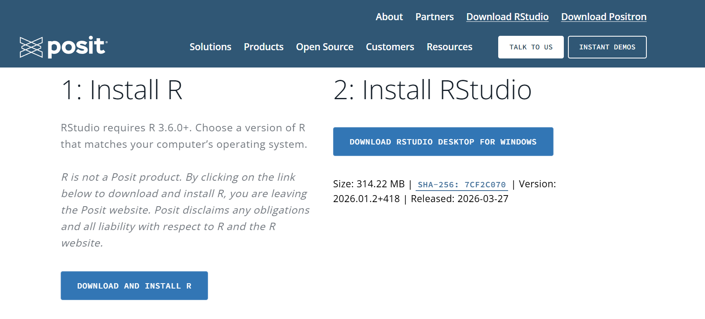
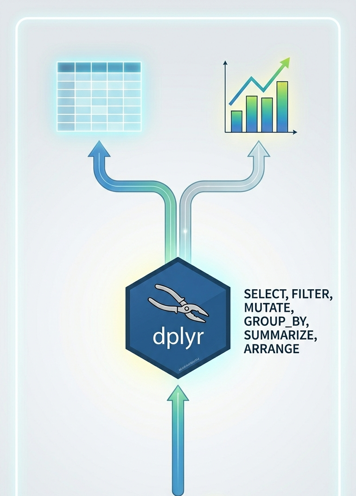

---
format:
  revealjs:
    theme: solarized
    slide-number: true
    transition: fade
    background-transition: slide
    scrollable: true
    code-copy: true
    code-overflow: wrap
    code-block-height: 300px
    highlight-style: github
    toc: false
    toc-depth: 2
    css: styles.css
    
lang: es
---

# ** desde cero:** Analizando el impacto de la vida digital

<br><br>

¿Te animas a aprender R  y descubrir qué dicen los datos sobre redes sociales y salud mental?


---

## Seamos honestos... {vertical-align="center"}


::: {.incremental}


<br>

Han sentido que el uso del celular afecta su:

<br>


::: {.columns}

::: {.column width="45%"}

### [Salud mental]{style="color: #a04000; border-bottom: 2px solid #a04000;"}


{fig-align="left" width="80%"}

:::


::: {.column width="10%"}

:::


::: {.column width="45%"}

### [Rendimiento]{style="color: #a04000; border-bottom: 2px solid #a04000;"}


{fig-align="left" width="80%"}

:::

:::

<br>

¿Han intentado borrar redes... y después volverlas a instalar?

:::

---

## Si su respuesta fue sí, **no están solos.**

<br>

Muchas personas han sentido cambios en su día a día relacionados con el uso del celular. 

<br>

::: {.callout-tip appearance="simple"}
## Nuestra propuesta
Hoy los invitamos a ir más allá: analizaremos un **conjunto de datos real** para descubrir qué está pasando realmente en relación a:

- Uso de redes sociales
- Calidad del sueño
- Salud mental
:::

---

## [¿Cómo lo vamos a hacer?]{style="color: #a04000; border-bottom: 2px solid #a04000;"}


::: {.incremental}

<br>

### 1. Preparación del entorno
* Familiarización con **R y RStudio**.

### 2. Exploración del dataset
* **Carga de datos** y reconocimiento de variables.
* Análisis de la naturaleza de las variables.

### 3. Procesamiento y Análisis
* Filtrado y agrupación de información clave.

### 4. Visualización e Interpretación
* Construcción de gráficos.
* Traducción de datos en hallazgos sobre el impacto de las redes sociales.

:::

# 1. Preparación del entorno  {background-color="#f8f9fa"}

## - Instalación de  {background-color="#f8f9fa"}

Para poder continuar con el taller, es necesario que:

1. Ya tengan instalado **R** en sus equipos. Si aún no lo tienen, pueden visitar [CRAN](https://cran.r-project.org/).

2. Tener **Rstudio** instalado. En la página de [posit](https://posit.co/download/rstudio-desktop) pueden encontrarlo.

{fig-align="center" width="80%"}


---

## - Interfaz

](interfaz.png){fig-align="center" width="100%"}


## - Operaciones aritméticas {background-color="#f8f9fa"}

::: {.fragment}

1. Suma

```{r}
#| echo: true
#| code-line-numbers: true

2 + 2
```

::: 

::: {.fragment}

2. Resta

```{r}
#| echo: true

2 - 2
```

::: 

::: {.fragment}
3. Multiplicación

```{r}
#| echo: true

2 * 2
```
:::


::: {.fragment}

4. División

```{r}
#| echo: true

2 / 2
```

:::

::: {.fragment}


5. Raíz Cuadrada


```{r}
#| echo: true

sqrt(2)
```
:::

## - Operaciones Relacionales

::: {.fragment}

1. Igualdad

```{r}
#| echo: true
2 == 2
"Q'bo" == "Vemos"
```
:::

::: {.fragment}

2. Distinto

```{r}
#| echo: true
3 != 2

```
:::

::: {.fragment}

3. Mayor que

```{r}
#| echo: true

15 > 15
```
:::

::: {.fragment}
4. Mayor o igual que

```{r}
#| echo: true

15 >= 5
```

:::

::: {.fragment}

5. Menor que

```{r}
#| echo: true

15 < 5
```

:::

::: {.fragment}

6. Menor o igual que

```{r}
#| echo: true
15 <= 15
```


:::


## - Asignación de objetos a variables y tipos de objetos {background-color="#f8f9fa"}


::: {.fragment}

1. Entero

```{r}
#| echo: true
objeto <- 2L
typeof(objeto)
```

:::

::: {.fragment}

2. Float (Double)

```{r}
#| echo: true
objeto2 <- objeto / 3
objeto2
typeof(objeto2)
```

:::

::: {.fragment}

3. Cáracter

```{r}
#| echo: true

objeto3 <- "Hola"
typeof(objeto3)
```

:::

::: {.fragment}

4. Booleano

```{r}
objeto4 <- TRUE
typeof(objeto4)

```
:::

---

## - Estructuras básicas

::: {.fragment}

1. Vector numérico

```{r}
#| echo: true

objeto5 <- c(2, 4, 6)
objeto5

class(objeto5)
```
:::

::: {.fragment}

2. Vector de carácteres

```{r}
#| echo: true

objeto6 <- c("Bienvenido", "al", "taller")
objeto6

class(objeto6)
```
:::

::: {.fragment}

3. Matriz

```{r}
#| echo: true

objeto7 <- matrix(c(1, 2, 3,
                    4, 5, 6),
                  nrow = 2, 
                  ncol = 3)

objeto7

class(objeto7)

```

:::

::: {.fragment}

4. Data frame

```{r}
#| echo: true
nombres <- c("Ana", "Luis", "Marta", "Juan")
edades <- c(20, 22, 21, 23)
aprueba <- c(TRUE, FALSE, TRUE, TRUE)

clase <- data.frame(nombres, edades, aprueba)
clase
```


```{r}
#| echo: true
class(clase)
```

:::


## - Directorio {background-color="#f8f9fa"}

Para poder conocer su directorio de trabajo, basta con la función `getwd()`.

```{r}
#| echo: true
getwd()
```

Para poder ver los archivos y carpetas que tienen en dicho directorio, se usa la función `dir()`

```{r}
#| echo: true
dir()
```
Si tienen los archivos con los que van a trabajar en otro directorio, entonces se usa `setwd()`

```{r}
#| echo: true
#| eval: false

setwd("C:\\Users\\sofia\\Downloads\\Taller R versión 2")
```

## - Paquetes

Un **paquete** es un conjunto de funciones, datos y documentación que amplía las capacidades de R. Gracias a los paquetes, es posible realizar un montón de tareas de manera más sencilla.

* **readxl**: importar archivos de Excel (.xlsx)
* **dplyr**: manipulación y transformación de datos
* **ggplot2**: visualización de datos
* **haven**: importar archivos de Stata, SPSS y SAS

### - Instalación y cargado de paquetes

La instalación de un paquete se realiza una única vez en el equipo en el que se esté trabajando. Por otro lado, para poder usarlo, es necesario cargarlo en cada sesión de R.

```{r}
#| eval: false
#| echo: true
install.packages("readxl") # Instalación

library(readxl) # Se carga el paquete
```


## - Tipos de Archivos

Las bases de datos que se quieran trabajar pueden ser de distintos formatos:

* Texto plano: CSV (*.csv*), TXT (*.txt*)
* Hojas de cálculo: Excel (*.xlsx*)
* Otros software: Stata (*.dta*), SAS (*.sas7bdat*)
* Formatos de R: RData (*.RData*), Rda (*.rda*)
* Formatos de Big Data: Parquet (*.parquet*)

Algunas funciones para importar archivos vienen preinstalados en R, pero otras requieren instalar **paquetes** adicionales. Por ejemplo, uno de los tipos de archivo más comunes es el formato *.xlsx*.

# 2. Importación de archivos {background-color="#f8f9fa"}

## - Base de datos a trabajar

Los datos que se usarán en esta sesión provienen de **Kaggle**. Estos los pueden encontrar el siguiente [link](https://www.kaggle.com/datasets/sumeakash/impact-of-social-media-on-health). 

En esta base de datos se cuenta con información sobre el impacto de las plataformas digitales y la IA sobre los estudiantes, tanto en su vida personal como académica.

### Descripción de las variables


| Variable | Descripción |
|:---|:---|
| **Student_ID** | Identificador único para cada estudiante. |
| **Age** | Edad del estudiante (en años). |
| **Gender** | Género del estudiante (Masculino/Femenino). |
| **Academic_Level** | Nivel educativo (Escuela / College / Universidad). |
| **Country** | País o ubicación del estudiante. |
| **Avg_Daily_Usage_Hours** | Promedio de horas diarias en plataformas digitales/IA. |
| **Most_Used_Platform** | Plataforma usada con más frecuencia (ej. ChatGPT, Gemini). |
| **Affects_Academic_Performance** | Impacto en el rendimiento (Mejora / Sin cambio / Declive). |
| **Sleep_Hours_Per_Night** | Duración promedio del sueño por noche. |
| **Mental_Health_Score** | Puntaje que representa el bienestar mental. |
| **Overall_Impact** | Efecto general del uso (Positivo / Neutral / Negativo). |

: Descripción de variables del dataset {#tbl-variables}


## - Importación de la base de datos

Al descargar el archivo, es posible ver su extensión (*.csv*). De esta forma, se usa la función `read.csv()`.

```{r}
#| echo: true

df <- read.csv("Social_media_impact_on_life.csv")


```


Ahora, miramos el tipo de objeto y cómo podemos obtener una rápida visualización de su contenido con las funciones ` class()` y `str()` o `head()`.

```{r}
#| echo: true
class(df)
```
```{r}
#| echo: true
str(df)
```

Si queremos ver sus diez primeras filas:

```{r}
#| echo: true
head(df, n = 10)
```


# 3. Procesamiento y Análisis

::: {.columns}

::: {.column width="60%"}
Se utilizará el paquete **{dplyr}** para una manipulación de datos eficiente:

* **Filtrado y Selección:** Limpieza precisa de observaciones y variables.
* **Transformación:** Creación de nuevas variables.
* **Encadenamiento:** Uso de *pipes* facilita la creación de flujos de trabajo claros y legibles.
:::

::: {.column width="40%"}
{width=80% fig-align="center"}
:::

:::

---

## - Primera herramienta: `select()` {background-color="#f8f9fa"}

### A. Filtrando el ruido 

La función `select()` de `dplyr` sirve para elegir columnas específicas de un conjunto de datos.

::: {.columns}
::: {.column width="45%"}
**La pregunta:**
¿Qué variables son clave para medir el impacto digital?


::: {.column width="55%"}
```{r}

#setwd("C:\\Users\\sofia\\Downloads\\Taller R versión 2")

library(readr)
library(dplyr)
df <- read_csv("Social_media_impact_on_life.csv")

df_relevante <- df %>% 
  select(Age, Gender, Mental_Health_Score, 
         Avg_Daily_Usage_Hours, Sleep_Hours_Per_Night, 
         Overall_Impact)

# O descartando lo innecesario
df_limpio <- df %>% 
  select(-Student_ID)
```

  
